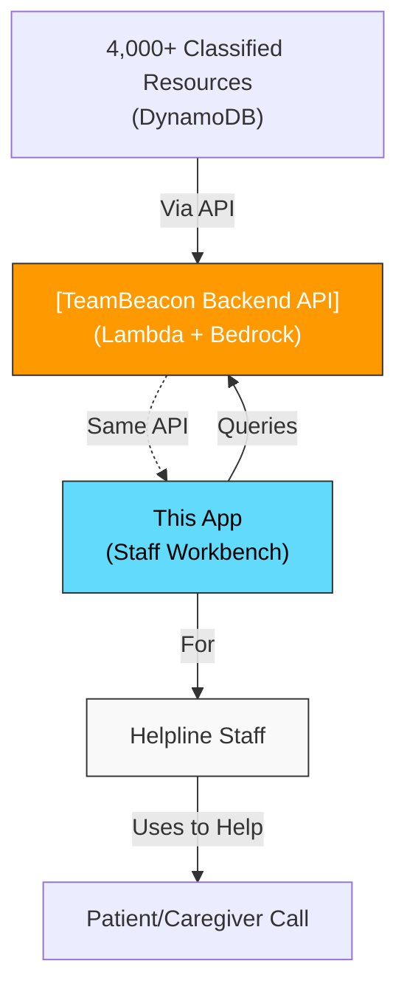

# Encephalitis Support Workbench - AWS Edition

<div align="center">


**AI-powered support workbench for healthcare staff, built on AWS serverless architecture**

[Quick Start](#quick-start) • [Documentation](#documentation) • [Architecture](#architecture) • [Deployment](#deployment)

</div>

---

## 📋 Overview

This is an AWS-native version of the Encephalitis Support Workbench, migrated from Google AI Studio. It helps charity staff provide personalized support by:

- 🔍 **Searching** patient/caregiver profiles from CRM
- 📝 **Capturing** intake information (rapid or detailed modes)
- 🤖 **Suggesting** relevant resources using AI (Amazon Bedrock)
- ✅ **Curating** resources with human oversight
- ✉️ **Generating** personalized, modular email drafts

### Key Features

✅ **Complete Feature Parity** with Google AI Studio version
✅ **Secure Architecture** - No API keys in frontend
✅ **Serverless & Scalable** - Auto-scaling AWS infrastructure
✅ **Production-Ready** - Comprehensive monitoring and logging
✅ **Cost-Effective** - Pay-per-use pricing model

### Impact
- ⏱️ **30 minutes → 3 minutes** - Resource search during calls
- 📦 **4,000+ resources** at staff fingertips
- 📧 **Email drafts** auto-generated for follow-ups
- 👥 **10x capacity** for same staff size

---

## 🔗 System Context

The **internal staff tool** in the Encephalitis International support platform:



**Your Role:**
- **Internal tool** used by Encephalitis International helpline staff during live calls
- **Serves same API** as public frontend ([TeamBeacon Frontend](../../man01-teambeacon-frontend/))
- **Queries classified resources** from [TeamBeacon Backend](../../man01-teambeacon/)
- **Accelerates** response time from 30 min to 3 min per call

**Related Systems:**
- [Resource Classification System](../../resource-classification-system/) - Classifies the 4,000+ resources
- [TeamBeacon Backend](../../man01-teambeacon/) - Provides the REST API you use
- [TeamBeacon Frontend](../../man01-teambeacon-frontend/) - Public-facing version for patients

---

```
┌─────────────┐
│   Browser   │
└──────┬──────┘
       │ HTTPS
       ▼
┌─────────────────┐
│ Amplify/CloudFront │
└──────┬──────────┘
       │ REST API
       ▼
┌─────────────────┐
│  API Gateway    │
└──────┬──────────┘
       │
       ▼
┌─────────────────┐      ┌──────────────┐
│  Lambda         │─────▶│   Bedrock    │
│  Functions      │      │   (Claude)   │
└──────┬──────────┘      └──────────────┘
       │
       ▼
┌─────────────────┐
│   S3 Bucket     │
│ (Knowledge Base)│
└─────────────────┘
```

### AWS Services Used

| Service | Purpose | Cost Impact |
|---------|---------|-------------|
| **Amazon Bedrock** | AI inference (Claude 3.5 Sonnet) | High (~$60/mo for 10K requests) |
| **AWS Lambda** | Serverless API functions | Low (~$0.10/mo) |
| **API Gateway** | REST API endpoints | Low (~$0.04/mo) |
| **Amazon S3** | Knowledge base storage | Minimal (~$0.05/mo) |
| **AWS Amplify** | Frontend hosting | Medium (~$15/mo) |
| **CloudWatch** | Logging and monitoring | Minimal |

## 🚀 Quick Start

### Prerequisites

- ✅ AWS Account with Bedrock access
- ✅ Node.js 18+
- ✅ AWS CLI configured
- ✅ AWS SAM CLI installed

### 1. Enable Bedrock Models (5 minutes)

```bash
# Go to AWS Console → Amazon Bedrock → Model access
# Request access to: Claude 3.5 Sonnet
# Wait for "Access granted" status
```

### 2. Deploy Backend (5 minutes)

```bash
cd backend
npm install
sam build
sam deploy --guided
```

**Save the API Gateway URL from the output!**

### 3. Configure & Run Frontend (2 minutes)

```bash
cd frontend
npm install
cp .env.example .env.local
# Edit .env.local with your API Gateway URL
npm run dev
```

Open http://localhost:5173 🎉

### 4. Deploy to Production (2 minutes)

**Option A: AWS Amplify (Recommended)**
- Push code to GitHub
- Connect repository in Amplify Console
- Add environment variable: `VITE_API_ENDPOINT`
- Deploy automatically

**Option B: S3 + CloudFront**
```bash
npm run build
aws s3 sync dist/ s3://your-bucket-name
```

## 📚 Documentation

| Document | Description |
|----------|-------------|
| [QUICKSTART.md](./QUICKSTART.md) | 15-minute setup guide |
| [DEPLOYMENT.md](./DEPLOYMENT.md) | Detailed deployment instructions |
| [ARCHITECTURE.md](./ARCHITECTURE.md) | System design and architecture |
| [MIGRATION-GUIDE.md](./MIGRATION-GUIDE.md) | Google → AWS migration details |
| [AWS-vs-GOOGLE.md](./AWS-vs-GOOGLE.md) | Comparison and decision guide |
| [DEPLOYMENT-CHECKLIST.md](./DEPLOYMENT-CHECKLIST.md) | Complete deployment checklist |

## 💰 Cost Comparison

### Small Scale (100 users, 5 requests/user/month)

| Platform | Monthly Cost |
|----------|-------------|
| Google AI Studio | $20 |
| **AWS (Claude 3.5 Sonnet)** | **$18** |
| AWS (Claude 3 Haiku) | $5 |

### Medium Scale (1,000 users, 10 requests/user/month)

| Platform | Monthly Cost |
|----------|-------------|
| Google AI Studio | $200 |
| **AWS (Claude 3.5 Sonnet)** | **$75** |
| AWS (Claude 3 Haiku) | $30 |

**AWS becomes significantly more cost-effective at scale!**

## 🔒 Security & Compliance

- ✅ **No API keys in frontend** - IAM role-based authentication
- ✅ **HTTPS/TLS encryption** - All data in transit
- ✅ **HIPAA-eligible** - With Business Associate Agreement
- ✅ **SOC 2 compliant** - AWS infrastructure
- ✅ **Audit logging** - CloudTrail integration
- ✅ **VPC support** - Optional network isolation

## 🛠️ Development

### Local Development

```bash
# Frontend
cd frontend
npm run dev

# Backend (local testing)
cd backend
sam local start-api
```

### Testing Lambda Functions

```bash
# Test suggest-resources function
sam local invoke SuggestResourcesFunction -e events/test-suggest-resources.json

# Test generate-draft function
sam local invoke GenerateDraftFunction -e events/test-generate-draft.json
```

### View Logs

```bash
# Tail Lambda logs
sam logs -n SuggestResourcesFunction --tail

# View CloudWatch logs
aws logs tail /aws/lambda/encephalitis-workbench-SuggestResourcesFunction --follow
```

## 📊 Monitoring

### CloudWatch Dashboards

- Lambda invocations, duration, errors
- API Gateway requests, latency, 4xx/5xx
- Bedrock token usage

### Alarms

- Lambda error rate > 5%
- API Gateway latency > 5s
- Cost anomaly detection

## 🔄 Migration from Google AI Studio

### Key Changes

| Aspect | Google | AWS |
|--------|--------|-----|
| **AI Service** | Gemini API | Bedrock (Claude) |
| **Architecture** | Direct API | API Gateway + Lambda |
| **Authentication** | API Key | IAM Roles |
| **Hosting** | AI Studio | Amplify/S3 |

### Migration Steps

1. ✅ Deploy AWS backend infrastructure
2. ✅ Update frontend to use REST API
3. ✅ Test all features
4. ✅ Deploy to production
5. ✅ Monitor and optimize

See [MIGRATION-GUIDE.md](./MIGRATION-GUIDE.md) for detailed instructions.

## 🎯 Use Cases

### When to Use AWS Version

✅ Production deployment
✅ Enterprise scale (>1,000 users)
✅ HIPAA/SOC2 compliance required
✅ Existing AWS infrastructure
✅ Advanced monitoring needs
✅ Complex integrations

### When to Use Google AI Studio Version

✅ Rapid prototyping
✅ Small scale (<100 users)
✅ Simple use case
✅ Limited AWS expertise

## 🚧 Roadmap

### Phase 1: Core Features ✅
- [x] Resource suggestion with AI
- [x] Draft generation
- [x] Knowledge base integration
- [x] Multi-step workflow

### Phase 2: Enhancements 🔄
- [ ] AWS Cognito authentication
- [ ] DynamoDB for user profiles
- [ ] SES email integration
- [ ] Real-time updates (WebSocket)

### Phase 3: Advanced Features 📋
- [ ] Multi-region deployment
- [ ] Bedrock Knowledge Bases (RAG)
- [ ] Advanced analytics
- [ ] Mobile app

## 🤝 Contributing

Contributions welcome! Please read our contributing guidelines first.

## 📄 License

MIT License - see LICENSE file for details

## 🆘 Support

- **Documentation**: See docs folder
- **Issues**: GitHub Issues
- **AWS Support**: AWS Support Portal
- **Community**: AWS Forums

## 🙏 Acknowledgments

- Original Google AI Studio version
- Encephalitis International charity
- AWS Bedrock team
- Open source community

---

<div align="center">

**Built with ❤️ using AWS Serverless**

[Report Bug](https://github.com/your-org/encephalitis-workbench/issues) • [Request Feature](https://github.com/your-org/encephalitis-workbench/issues)

</div>
