# Visual Architecture Diagrams

## 1. System Architecture (Mermaid)

```mermaid
graph TB
    subgraph Users["👥 User Layer"]
        Desktop["🖥️ Desktop Browser"]
        Tablet["📱 Tablet Browser"]
        Mobile["📱 Mobile Browser"]
    end

    subgraph CDN["🌐 Content Delivery Network"]
        Amplify["AWS Amplify<br/>Static Hosting + CI/CD"]
        CloudFront["Amazon CloudFront<br/>Global CDN<br/>SSL/TLS"]
    end

    subgraph API["🔌 API Layer"]
        APIGateway["Amazon API Gateway<br/>REST API<br/><br/>Endpoints:<br/>• POST /suggest-resources<br/>• POST /generate-draft<br/>• POST /upload-knowledge-base"]
    end

    subgraph Compute["⚡ Serverless Compute"]
        Lambda1["AWS Lambda<br/>suggestResources<br/><br/>Node.js 20.x<br/>512 MB RAM<br/>60s timeout"]
        Lambda2["AWS Lambda<br/>generateDraft<br/><br/>Node.js 20.x<br/>512 MB RAM<br/>60s timeout"]
        Lambda3["AWS Lambda<br/>uploadKnowledgeBase<br/><br/>Node.js 20.x<br/>512 MB RAM<br/>60s timeout"]
    end

    subgraph AI["🤖 AI Services"]
        Bedrock["Amazon Bedrock<br/>Claude 3.5 Sonnet<br/><br/>Model ID:<br/>anthropic.claude-3-5-sonnet-20241022-v2:0<br/><br/>• 200K context window<br/>• JSON responses<br/>• System prompts"]
    end

    subgraph Storage["💾 Storage"]
        S3["Amazon S3<br/>Knowledge Base Bucket<br/><br/>Structure:<br/>knowledge-base/<br/>  └── *.json"]
    end

    subgraph Monitoring["📊 Monitoring & Logging"]
        CloudWatch["Amazon CloudWatch<br/><br/>• Lambda metrics<br/>• API Gateway logs<br/>• Custom dashboards<br/>• Alarms"]
    end

    Desktop --> Amplify
    Tablet --> Amplify
    Mobile --> Amplify
    
    Amplify --> CloudFront
    CloudFront --> APIGateway
    
    APIGateway --> Lambda1
    APIGateway --> Lambda2
    APIGateway --> Lambda3
    
    Lambda1 --> Bedrock
    Lambda2 --> Bedrock
    Lambda1 --> S3
    Lambda3 --> S3
    
    Lambda1 -.-> CloudWatch
    Lambda2 -.-> CloudWatch
    Lambda3 -.-> CloudWatch
    APIGateway -.-> CloudWatch
```




## 2. Data Flow Diagram (Mermaid)


## 3. Component Architecture (Mermaid)


## 4. Deployment Architecture (Mermaid)


## 5. Security Architecture (Mermaid)


## 6. Cost Breakdown (Mermaid)


## 7. User Workflow (Mermaid)


## 8. Network Diagram (Mermaid)


## How to View These Diagrams

### GitHub
These Mermaid diagrams render automatically on GitHub. Just view this file in your repository.

### VS Code
Install the "Markdown Preview Mermaid Support" extension:
```bash
code --install-extension bierner.markdown-mermaid
```

### Online Viewers
- **Mermaid Live Editor**: https://mermaid.live/
- **GitHub Gist**: Create a gist with this file
- **GitLab**: Supports Mermaid natively

### Export as Images
Use the Mermaid CLI:
```bash
npm install -g @mermaid-js/mermaid-cli
mmdc -i architecture-diagram.mmd -o architecture-diagram.png
```

### Documentation Sites
These diagrams work in:
- **Docusaurus**
- **MkDocs** (with plugin)
- **GitBook**
- **Notion** (paste Mermaid code)
- **Confluence** (with Mermaid plugin)

## Diagram Files

- `VISUAL-ARCHITECTURE.md` - This file (all diagrams)
- `architecture-diagram.mmd` - Standalone Mermaid file
- `ARCHITECTURE-DIAGRAM.md` - ASCII art version

## Legend

| Symbol | Meaning |
|--------|---------|
| Solid Arrow (→) | Direct connection/data flow |
| Dotted Arrow (-.→) | Monitoring/logging/auth |
| Subgraph | Logical grouping of components |
| 🖥️ 📱 | User devices |
| 🌐 | CDN/Global services |
| 🔌 | API endpoints |
| ⚡ | Compute services |
| 🤖 | AI services |
| 💾 | Storage services |
| 📊 | Monitoring services |
| 🔒 | Security services |

## How to View These Diagrams

### GitHub
All Mermaid diagrams render automatically when viewing this file on GitHub.

### VS Code
Install the "Markdown Preview Mermaid Support" extension to view diagrams in preview mode.

### Other Tools
- **Mermaid Live Editor**: https://mermaid.live/
- **Draw.io**: Import the .mmd file
- **Notion**: Supports Mermaid diagrams
- **Confluence**: Use Mermaid macro

## Diagram Files

- `VISUAL-ARCHITECTURE.md` - This file (Mermaid diagrams)
- `architecture-diagram.mmd` - Standalone Mermaid file
- `ARCHITECTURE-DIAGRAM.md` - ASCII art diagrams
- `ARCHITECTURE.md` - Detailed text documentation

## Legend

| Symbol | Meaning |
|--------|---------|
| → | Direct connection/flow |
| -.-> | Indirect/monitoring connection |
| Solid box | AWS Service |
| Dashed box | Logical grouping |
| 🖥️ | User interface |
| ⚡ | Compute service |
| 🤖 | AI service |
| 💾 | Storage service |
| 🔒 | Security component |
| 📊 | Monitoring component |

## Architecture Principles

1. **Serverless First**: No servers to manage, auto-scaling
2. **Security by Design**: IAM roles, no exposed credentials
3. **Cost Optimized**: Pay-per-use, no idle resources
4. **Highly Available**: Multi-AZ deployment, managed services
5. **Observable**: CloudWatch logging and monitoring throughout
6. **Scalable**: Handles 1 to 10,000+ concurrent users

## Key Metrics

| Metric | Value |
|--------|-------|
| **Latency** | 2-5 seconds (AI processing) |
| **Availability** | 99.95% (AWS SLA) |
| **Scalability** | Unlimited concurrent users |
| **Cost** | $75/month for 10K requests |
| **Regions** | Single region (expandable) |
| **Cold Start** | 1-2 seconds (Lambda) |

## Related Documentation

- [README.md](./README.md) - Project overview
- [ARCHITECTURE.md](./ARCHITECTURE.md) - Detailed architecture
- [DEPLOYMENT.md](./DEPLOYMENT.md) - Deployment guide
- [QUICKSTART.md](./QUICKSTART.md) - Quick setup guide
