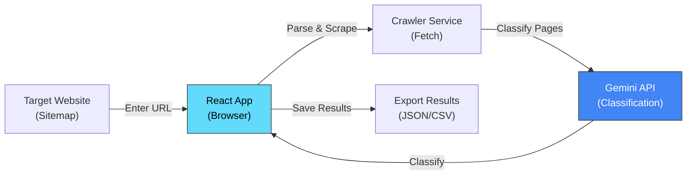

# Web Scraper - Content Discovery & Classification Tool

**Interactive React application for parsing sitemaps, scraping web content, and classifying pages using AI**

[](https://react.dev)
[](https://www.typescriptlang.org/)
[](https://ai.google.dev/)
[](https://aws.amazon.com/events/aws-breaking-barriers-challenge/)

## 🎯 Overview

A proof-of-concept (POC) application for demonstrating automated content scraping and AI-powered classification workflows. While the main platform uses AWS Bedrock, this tool showcases the same classification pipeline using Google Gemini AI, providing an alternative proof for concepts before committing to cloud infrastructure costs.

### Use Cases

1. **Testing Classification on New Domains**
   - Test the classification workflow on a new website before batch processing
   - Validate taxonomy against different content types
   - Estimate classification costs and time

2. **Real-time Progress Monitoring**
   - Visual dashboard showing classification progress
   - ETA calculation based on content volume
   - Real-time error tracking and recovery

3. **Workflow Demonstration**
   - Non-technical stakeholders can see the classification pipeline in action
   - Compare different AI models for classification (Gemini vs Bedrock)
   - Validate content relevance before production deployment

---

## 🏗️ Architecture



---

## 🚀 Quick Start

### Prerequisites

- **Node.js 18+** and npm
- **Google Gemini API Key** ([Get free API key here](https://ai.google.dev/))

### Installation

```bash
# 1. Install dependencies
npm install

# 2. Set up environment variables
cp .env.example .env.local

# 3. Add your Gemini API key to .env.local
VITE_GEMINI_API_KEY=your_api_key_here

# 4. Start development server
npm run dev

# 5. Open http://localhost:5173 in your browser
```

### First Classification Run

1. Enter a sitemap URL (e.g., `https://www.encephalitis.info/sitemap.xml`)
2. Adjust batch size (5-20 recommended for testing)
3. Click "Start Classification"
4. Monitor real-time progress
5. Export results as JSON or CSV

---

## 🔗 How This Fits in the System

**Testing tool for the main platform:**

```
Production Pipeline:
[Resource Classification System] ← Uses AWS Bedrock
     ↓
[4,000+ Classified Resources]
     ↓
[TeamBeacon Backend API]
     ↓
[Public Frontend + Staff Workbench]

This Tool (Web Scraper):
- Side-by-side testing with Gemini
- Validates classification before production run
- Demonstrates workflow to stakeholders
```

**Comparison:**
- **This Tool**: Gemini API, interactive UI, slower, lower cost, validates new sources
- **Production**: Bedrock API, batch CLI, faster, higher throughput, processes 4,000+ items

---

## 📁 Project Structure

```
Web-Scraper/
├── src/
│   ├── components/
│   │   ├── SitemapInput.tsx
│   │   ├── ClassificationDashboard.tsx
│   │   ├── ProgressChart.tsx
│   │   └── ResultsExporter.tsx
│   ├── services/
│   │   ├── crawler.ts          # Sitemap parser & scraper
│   │   ├── gemini.ts           # Gemini API integration
│   │   └── classifier.ts       # Classification logic
│   ├── App.tsx
│   └── main.tsx
├── vite.config.ts
└── package.json
```

---

## ⚙️ Configuration

### Environment Variables

```bash
VITE_GEMINI_API_KEY=your_gemini_api_key
VITE_MAX_CONCURRENT_REQUESTS=5
VITE_BATCH_SIZE=20
VITE_TIMEOUT_MS=30000
```

### Classification Tags

Uses same taxonomy as production system:

**Personas:** `patient`, `caregiver`, `professional`  
**Stages:** `pre_diagnosis`, `acute`, `recovery`, `long_term`  
**Topics:** `memory`, `rehabilitation`, `legal`, `school`, `employment`, etc.

---

## 📊 Performance

| Metric | Value |
|--------|-------|
| Sitemap Parse Time | <5 seconds (100 pages) |
| Classification/Item | 8-12 seconds (Gemini) |
| Batch Size | ~20 items (~3-5 minutes) |
| API Rate Limit | 15 req/min (free), 500 req/min (paid) |

---

## 🔄 Comparison with Production

| Feature | Web Scraper | Production System |
|---------|-------------|-------------------|
| AI Model | Gemini | Bedrock (Claude) |
| Interface | Interactive React | Command-line Python |
| Speed | Slower (8-12s/item) | Faster (20s/item) |
| Scale | Dozens → hundreds | Thousands (4,000+) |
| Cost | Lower (free tier) | Higher ($5-10 per 10K) |
| Purpose | Testing & POC | Production workload |

---

## 🔗 Related Projects

- **[Resource Classification System](../resource-classification-system/)** - Production batch pipeline using Bedrock
- **[TeamBeacon Backend](../man01-teambeacon/)** - REST API serving classified resources
- **[TeamBeacon Frontend](../man01-teambeacon-frontend/)** - Public app for resource discovery

---

## 📄 License

MIT License - See LICENSE file for details

---

**Built for AWS Breaking Barriers Challenge 2026**  
_Demonstrating AI-powered content classification for healthcare resource discovery_
