# Encephalitis International Resource Classification System

**AWS-Powered AI System for Intelligent Healthcare Resource Management**

[](https://aws.amazon.com/bedrock/)
[](https://www.anthropic.com/claude)

> Breaking Barriers Hackathon 2026 Submission  
> Empowering Encephalitis International with AI-driven resource classification

---

## 🎯 Overview

This system transforms how Encephalitis International manages and delivers support resources to patients, caregivers, and healthcare professionals. Using AWS Bedrock and Claude Opus 4.5, we've built an intelligent classification system that:

- **Automatically classifies 4,000+ resources** with 100+ tag categories
- **Scrapes and classifies web content in real-time** with adaptive learning
- **Provides personalized recommendations** based on user journey and needs
- **Evolves continuously** by identifying classification gaps

### The Challenge

Encephalitis International supports thousands of people affected by encephalitis worldwide. With 4,000+ resources, finding the right information at the right time is critical but challenging:

- **30 minutes per inquiry** to manually search and match resources
- Manual classification is time-consuming and inconsistent
- Staff struggle to find appropriate resources during live calls
- New content takes weeks to organize and integrate

### Our Solution

A comprehensive AWS-powered system that **reduces inquiry time from 30 minutes to ~3 minutes** (90% reduction):

1. **Batch Classification Pipeline** - One-time processing of existing resources (1,255 items)
2. **Real-Time Web Scraper** - Continuously monitors and classifies new content automatically

**Impact**: Staff can now help 10x more people in the same time, with better resource matching.

---

## � System Context & Architecture

This is the **core data preparation layer** for the entire Encephalitis International support platform:

```mermaid
graph TB
    A["📊 4,000+ Resources<br/>(Web Content, PDFs, Docs)"]
    B["🤖 This System<br/>(Batch + Real-Time)"]
    C["🗄️ DynamoDB<br/>(Tag-Indexed Store)"]
    D["⚡ TeamBeacon API<br/>(Classification Engine)"]
    E["👥 Public Frontend"]
    F["🏢 Staff Workbench"]
    
    A -->|Batch Processing| B
    B -->|Real-Time Scraping| B
    B -->|4,000+ Classified Items| C
    C -->|Query by Tags| D
    D -->|REST API| E
    D -->|REST API| F
    
    style B fill:#FF9900,stroke:#333,color:#fff
    style C fill:#527FFF,stroke:#333,color:#fff
    style D fill:#FF9900,stroke:#333,color:#fff
```



**Your Role:**
- **Batch Processing**: Classifies 4,000+ resources once using Claude AI with 100+ tags
- **Real-Time Monitoring**: Continuously scrapes and classifies new content from websites
- **Data Preparation**: Populates DynamoDB with tag-indexed resources
- **Enables**: Both public frontend and internal staff tools

**Feeds Data To:**
- [TeamBeacon Backend](../man01-teambeacon/) - REST API that uses your classified data
- [TeamBeacon Frontend](../man01-teambeacon-frontend/) - Public web app for patients/caregivers
- [Staff Workbench](../Staff-Workbench/) - Internal tool for helpline staff

---

> **New to the project?** See [Quick Start Guide](docs/deployment/QUICK_START.md) for a 5-minute guide to resilient processing.

### Batch Processing (Classify All 1,255 Existing Resources)

**Recommended for initial classification of the complete dataset.**

```bash
# 1. Install dependencies
pip install -r requirements.txt

# 2. Set AWS credentials
export AWS_ACCESS_KEY_ID="your_key"
export AWS_SECRET_ACCESS_KEY="your_secret"
export AWS_SESSION_TOKEN="your_token"
export AWS_DEFAULT_REGION="us-west-2"

# 3. Test with 5 items per source (recommended first step)
./processing/run_resilient.sh process_live_resources.py --test

# 4. Run full pipeline (1,255 resources with live sitemap scraping)
./processing/run_resilient.sh process_live_resources.py

# 5. Monitor progress (optional - can disconnect safely)
tail -f logs/classification_*.log

# 6. Upload to DynamoDB
python scripts/upload_to_dynamodb.py
```

**Time**: ~7 hours | **Cost**: ~£174-182 | **Value**: £2,950+ saved vs manual  
**Resilient**: ✅ Auto-saves every 5 items, auto-resumes, survives disconnections

> **Note**: Use `process_live_resources.py` for the full 1,255 resources (scrapes live from sitemap). For faster testing with cached data (1,003 items), use `process_all_resources.py`.

### Real-Time Web Scraper (Ongoing Monitoring After Batch Complete)

**Deploy this AFTER batch processing to automatically monitor for new content.**

```bash
# 1. Deploy infrastructure
cd web-scraper/infrastructure
npm install
cdk bootstrap  # First time only
cdk deploy

# 2. Configure and run frontend
cd ../frontend
cp .env.example .env
# Edit .env with your API URL
npm install
npm run dev
```

**Access**: http://localhost:3001

> **Note**: This is a separate AWS Lambda-based system for continuous monitoring. Deploy after completing the initial batch classification of 1,255 resources.

---

## 📊 System Architecture

```
┌─────────────────────────────────────────────────────────────┐
│                  RESOURCE CLASSIFICATION SYSTEM              │
└─────────────────────────────────────────────────────────────┘

┌──────────────────────┐         ┌──────────────────────────┐
│  BATCH PROCESSING    │         │  REAL-TIME WEB SCRAPER   │
│  (Python Pipeline)   │         │  (AWS Lambda + Gateway)  │
├──────────────────────┤         ├──────────────────────────┤
│ • Web content        │         │ • Sitemap parsing        │
│ • Spreadsheets       │         │ • Content scraping       │
│ • Contact databases  │         │ • Real-time classify     │
│ • 1,255 resources    │         │ • Adaptive learning      │
└──────────┬───────────┘         └──────────┬───────────────┘
           │                                │
           └────────────┬───────────────────┘
                        │
                        ▼
       ┌────────────────────────────────────┐
       │  AWS BEDROCK (Claude Opus 4.5)     │
       │  • 100+ tag classification         │
       │  • Confidence scoring              │
       │  • Gap identification              │
       │  • Staff guidance generation       │
       └────────────────┬───────────────────┘
                        │
       ┌────────────────┴───────────────────┐
       │                                    │
       ▼                                    ▼
┌──────────────────┐         ┌──────────────────────┐
│   DYNAMODB       │         │   S3 STORAGE         │
│   • Queryable    │         │   • Complete results │
│   • Fast access  │         │   • Analysis data    │
└──────────────────┘         └──────────────────────┘
```

---

## 🏷️ Classification Framework

### 100+ Tag Categories

**User Context (Who & When)**
- **Personas** (5): patient, caregiver, parent, professional, bereaved
- **Journey Stages** (4): pre-diagnosis, acute hospital, early recovery, long-term management
- **Locations**: UK, worldwide, Europe, country-specific
- **Condition Types** (7+): autoimmune, infectious, NMDA, MOG, TBE, HSV, post-infectious

**Resource Context (What & How)**
- **Symptoms** (10+): memory, behaviour, seizures, fatigue, mobility, speech, emotional
- **Topics** (15+): research, treatment, diagnosis, school, work, legal, travel
- **Resource Types** (11): factsheet, research, event, news, video, personal story
- **Content Attributes**: length, format, complexity, emotional tone, priority

**Smart Features**
- **Playlists**: Curated collections (newly diagnosed pack, caregiver support)
- **Confidence Scores**: Reliability indicators for every classification
- **Staff Guidance**: Practical tips for when to recommend each resource
- **Adaptive Learning**: System suggests new tags when gaps are identified

---

## 💡 Key Features

### 1. Intelligent Classification

Each resource receives comprehensive tagging with confidence scores, staff guidance, and metadata including reading time, complexity level, and emotional tone.

### 2. Adaptive Learning

System automatically identifies classification gaps and suggests new tags based on content analysis across multiple resources.

### 3. Real-Time Web Scraping

- Parse sitemaps automatically
- Scrape content with rate limiting
- Classify in real-time with Claude Opus 4.5
- Store results in S3 and DynamoDB
- Track progress with live updates

### 4. Multiple Output Formats

- **DynamoDB**: Fast queryable database for web apps (structured tag-based queries)
- **Knowledge Base**: Vector database for semantic search and RAG (natural language queries)
- **JSON**: Complete results with all metadata
- **Excel**: Human-readable spreadsheets for charity staff (6 sheets)

---

## 📁 Project Structure

```
resource-classification-system/
├── README.md                          # This file
├── HACKATHON.md                       # Hackathon submission
├── requirements.txt                   # Python dependencies
│
├── processing/                        # Processing scripts
│   ├── process_all_resources.py       # Main batch pipeline
│   ├── process_live_resources.py      # Live processing
│   └── run_resilient.sh               # Resilient wrapper
│
├── monitoring/                        # Monitoring tools
│   ├── monitoring_server_enhanced.py  # Monitoring server
│   └── test_monitoring_demo.py        # Demo script
│
├── scripts/                           # Core modules
│   ├── bedrock_tag_refinement_prompt.py
│   ├── excel_processor.py
│   └── upload_to_dynamodb.py
│
├── data/                              # Input data
│   ├── Live chat crib sheet.xlsx
│   └── Encephalitis orgs, centres and country contacts.xlsx
│
├── docs/                              # Documentation
│   ├── README.md                      # Documentation index
│   ├── charity/                       # For charity staff
│   ├── deployment/                    # Deployment guides
│   ├── technical/                     # Technical docs
│   ├── features/                      # Feature docs
│   └── changelog/                     # Development history
│
├── logs/                              # Log files
├── temp/                              # Temporary files
├── output/                            # Processing outputs
│
└── web-scraper/                       # Real-time component
    ├── frontend/                      # React UI
    ├── backend/                       # Lambda functions
    ├── infrastructure/                # AWS CDK
    └── docs/                          # Web scraper docs
```

---

## 🎓 Use Cases

### For Patients & Caregivers

**Scenario**: Newly diagnosed with NMDA receptor encephalitis

**Query**: `persona:patient AND condition:nmda_receptor AND stage:pre_diagnosis`

**Results**: Curated resources including factsheets, videos, support packs, and patient stories.

### For Healthcare Professionals

**Scenario**: Neurologist treating autoimmune encephalitis

**Query**: `persona:professional AND type:autoimmune AND topic:treatment`

**Results**: Research papers, treatment guidelines, clinical trials, and professional education.

### For Charity Staff

**Scenario**: Helpline staff supporting caregiver

**Staff View**: Resources with guidance on tone, timing, and follow-up recommendations.

---

## 📈 Impact & Metrics

### Charity Impact
- **30 minutes → ~3 minutes** per inquiry (90% reduction)
- **10x more people** can be helped in the same time
- **Better resource matching** with confidence scores
- **Consistent quality** across all staff members

### Processing Capacity

**Two Complementary Systems:**

1. **Batch Processing Pipeline (Python Scripts)**
   - **Purpose**: One-time classification of all 1,255 existing resources
   - **Script**: `process_live_resources.py` (recommended for full dataset)
   - **Speed**: ~20 seconds per resource (classification only)
   - **Total time**: ~7 hours for complete dataset
   - **Confidence**: 85%+ average scores
   - **When to use**: Initial classification, reclassification after taxonomy updates

2. **Real-Time Web Scraper (AWS Lambda System)**
   - **Purpose**: Continuous monitoring and automatic classification of NEW content
   - **Location**: `web-scraper/` directory (separate AWS infrastructure)
   - **Speed**: ~30-60 seconds per URL (includes scraping + classification)
   - **Deployment**: Runs continuously in AWS cloud
   - **When to use**: Ongoing monitoring after initial batch processing complete

### Impact & Value

**Transformational Staff Efficiency:**
- **Before**: 30 minutes per inquiry to manually find appropriate resources
- **After**: 3 minutes with AI-powered classification (90% reduction)
- **Result**: Staff can help **10x more people** in the same time
- **Annual impact**: Hundreds of hours freed for direct patient support

**Return on Investment:**

| Approach | Cost | Time | Outcome |
|----------|------|------|---------|
| **Manual Classification** | £3,135 | 209 hours | Inconsistent quality |
| **AI Classification** | £174-182 | 7 hours | 85%+ confidence |
| **Savings** | **£2,950+ (94%)** | **202 hours** | **Better quality** |

**ROI: 1,700%** - The system pays for itself immediately and continues delivering value.

**Ongoing Benefits:**
- **Consistency**: 85%+ confidence across all classifications (vs ~60% manual)
- **Availability**: 24/7 instant access for staff and patients
- **Scalability**: Same £0.14 per-item cost for thousands more resources
- **Speed**: New content classified automatically in minutes, not weeks
- **Quality**: Adaptive learning continuously improves taxonomy

---

## 🔧 Technical Stack

### AWS Services
- **AWS Bedrock**: Claude Opus 4.5 for AI classification
- **AWS Bedrock Knowledge Base**: Semantic search and RAG
- **Amazon Titan Embeddings**: Vector embeddings for similarity search
- **OpenSearch Serverless**: Vector database for semantic indexing
- **AWS Lambda**: Serverless compute
- **Amazon DynamoDB**: Fast queryable database
- **Amazon S3**: Object storage
- **Amazon SQS**: Queue management
- **API Gateway**: REST API
- **AWS CDK**: Infrastructure as code

### Languages & Frameworks
- **Python 3.9+**: Batch processing
- **TypeScript**: Lambda functions and infrastructure
- **React**: Frontend UI
- **Node.js 20+**: Runtime

---

## 📚 Documentation

### Quick Links

**Getting Started**:
- **[Quick Start Guide](docs/deployment/QUICK_START.md)** - Get started in 5 minutes
- **[Processing Guide](docs/deployment/PROCESSING_GUIDE.md)** - Processing scripts and options
- **[Resilient Processing](docs/deployment/RESILIENT_PROCESSING.md)** - Auto-save, resume, and retry features

**For Charity Staff**:
- **[Staff Guide](docs/charity/STAFF_GUIDE.md)** - Simple, non-technical guide for using the system
- **[User Guide](docs/USER_GUIDE.md)** - Detailed guide for charity staff

**For Developers**:
- **[Deployment Guide](docs/DEPLOYMENT.md)** - Step-by-step deployment
- **[Technical Guide](docs/TECHNICAL.md)** - Architecture and implementation
- **[AWS Architecture](docs/technical/AWS_ARCHITECTURE.md)** - Complete AWS architecture documentation
- **[Error Handling Guide](docs/technical/ERROR_HANDLING_GUIDE.md)** - Error handling patterns
- **[Knowledge Base Integration](docs/technical/KNOWLEDGE_BASE_INTEGRATION.md)** - Vector search setup

**Features**:
- **[Live Monitoring](docs/features/LIVE_MONITORING.md)** - Real-time dashboard for progress tracking
- **[Knowledge Base Quickstart](docs/features/KNOWLEDGE_BASE_QUICKSTART.md)** - Semantic search guide
- **[LLM Classification](docs/features/LLM_CLASSIFICATION_SUMMARY.md)** - Classification system details

**For Hackathon Judges**:
- **[Hackathon Submission](HACKATHON.md)** - Breaking Barriers criteria alignment

**Additional Resources**:
- **[Web Scraper Docs](web-scraper/docs/)** - Real-time component details
- **[Changelog](docs/changelog/)** - Development history and test results

---

## 🏆 Breaking Barriers Hackathon

This project demonstrates:

✅ **Innovation** - Adaptive classification system that learns from content  
✅ **Impact** - Empowers 4,000+ patients, caregivers, and professionals  
✅ **Technical Excellence** - Serverless architecture with AWS best practices  
✅ **Accessibility** - Multiple personas, journey stages, and confidence scoring  

See [HACKATHON.md](HACKATHON.md) for complete submission details.

---

## 🤝 Contributing

This project was developed for Encephalitis International as part of the Breaking Barriers Hackathon 2026.

---

## 📄 License

MIT License - See LICENSE file for details

---

## 🙏 Acknowledgments

- **Encephalitis International** for domain expertise and data
- **AWS** for Bedrock and cloud infrastructure
- **Anthropic** for Claude Opus 4.5
- **Breaking Barriers Hackathon** for the opportunity

---

**Built with ❤️ for Encephalitis International**  
**Powered by AWS Bedrock & Claude Opus 4.5**  
**Breaking Barriers Hackathon 2026**
